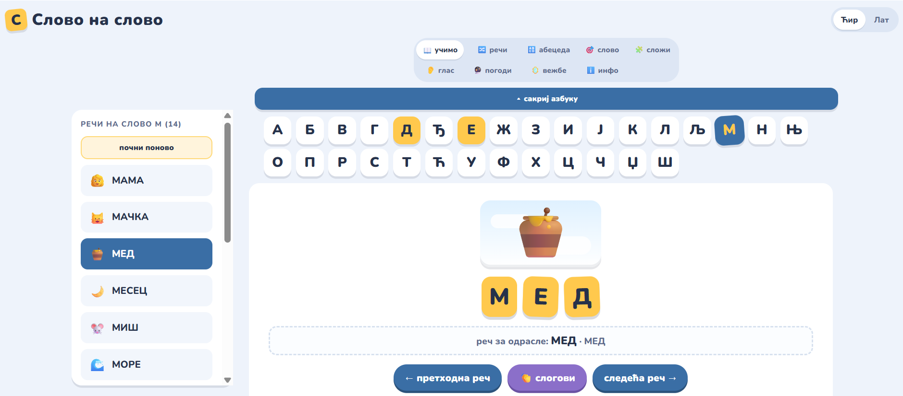
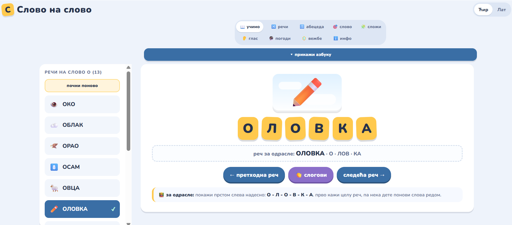
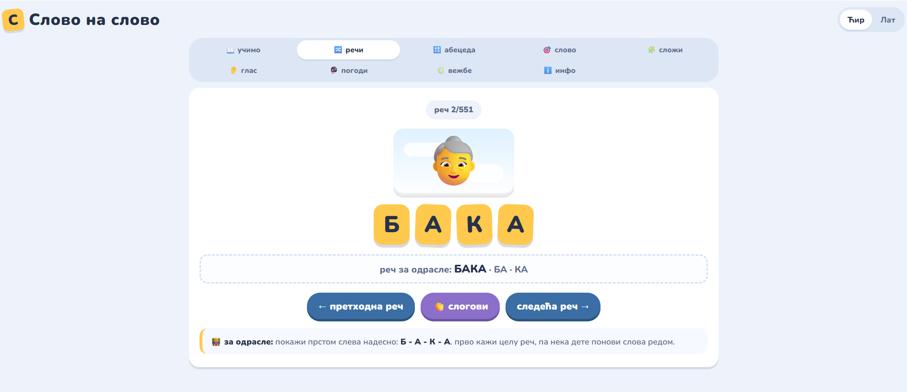
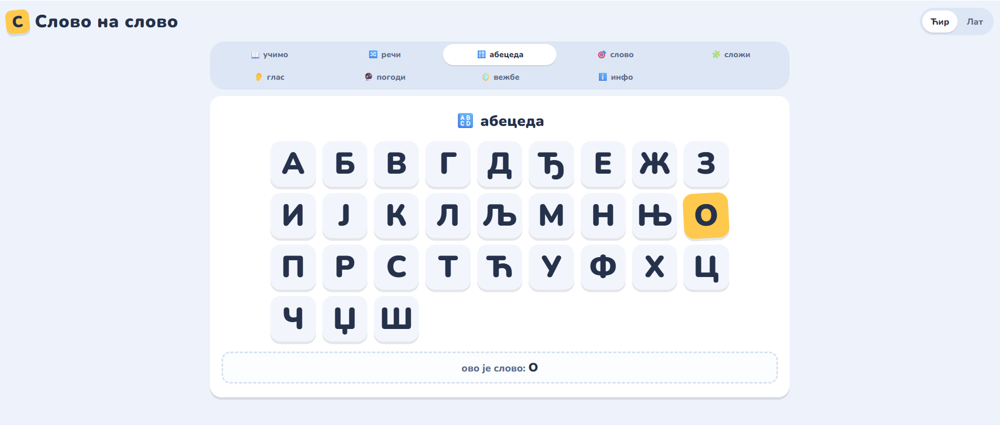
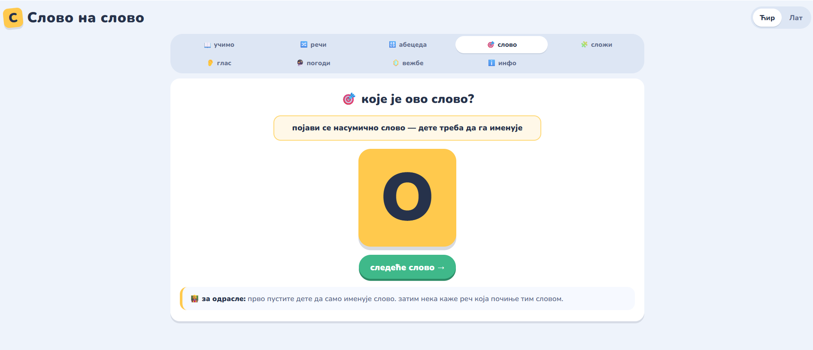
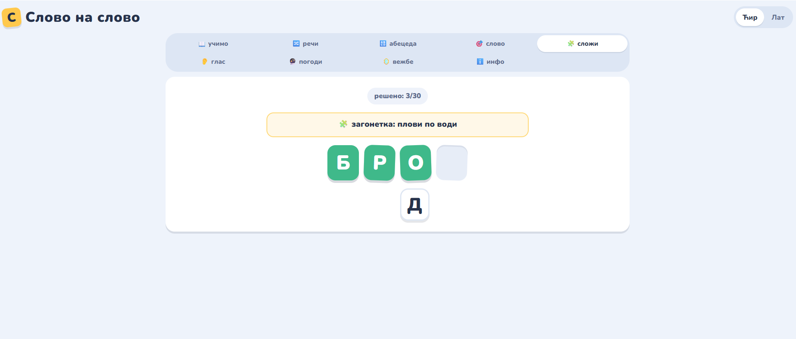
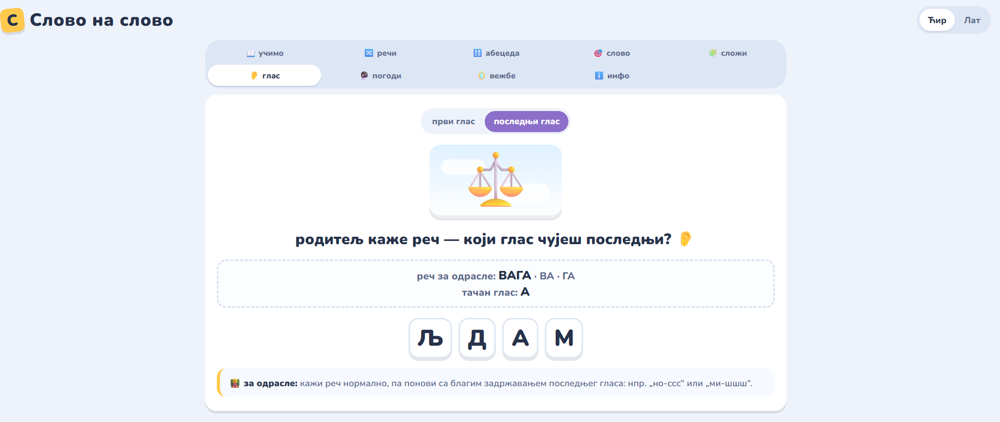
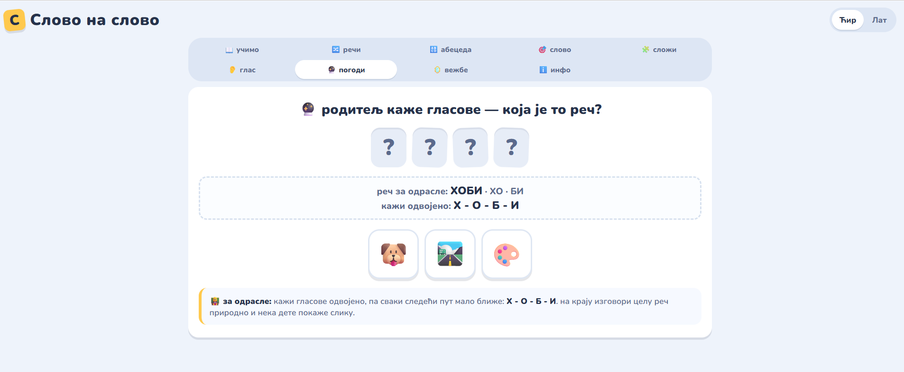
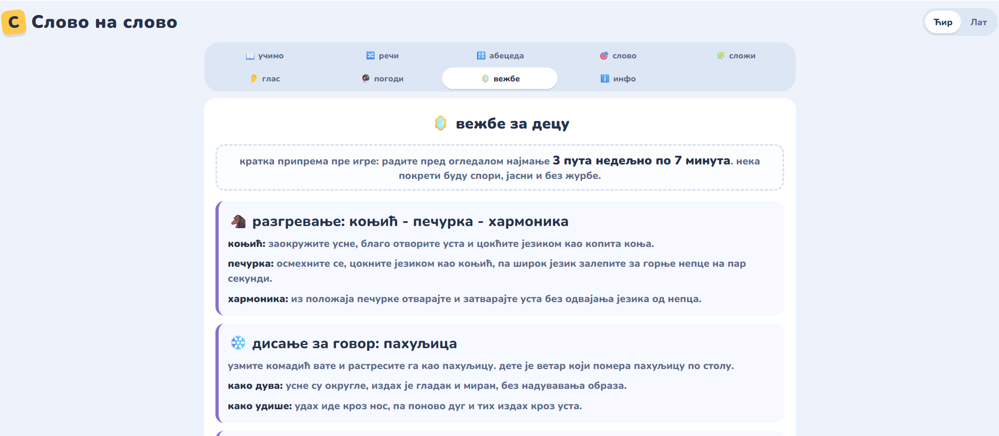

# Slovo na slovo

[Open the app on GitHub Pages](https://engelhardt-ana.github.io/slovo-na-slovo/)

Slovo na slovo is a browser-based educational app for early reading practice in Serbian. It supports Serbian Cyrillic and Latin scripts and helps children connect letters, sounds, syllables, pictures, and whole words.

The app does not use browser-generated speech. A parent, speech therapist, or teacher says the words aloud, while the app provides the visual structure, game flow, and short guidance for practice.

## Project Goal

The goal is to support children around ages 5 to 7 as they prepare for reading. The app is especially useful for practicing:

- Serbian Cyrillic and Latin letters;
- words that start with a selected letter;
- the idea that a word is built from letters and syllables;
- first and last sound awareness;
- blending separate sounds into a word;
- short child-friendly articulation and breathing warm-ups.

## Features

- `Learn`: choose a letter and explore words that start with it. Completed words are saved with checkmarks in the browser.
- `Words`: a random word-flow mode using the full word list, with previous/next navigation and a `word X/551` counter.
- `Alphabet`: large standalone Serbian letter cards.
- `Letter quiz`: one random letter at a time for the child to name aloud.
- `Build a word`: a 30-word riddle game where the child builds the answer letter by letter.
- `Guess the sound`: practice the first or last sound in a word.
- `Guess the word`: the adult says sounds separately and the child chooses the matching picture.
- `Exercises`: short warm-ups for children, including articulation and speech-breathing practice.
- `Info`: project description, goal, author, and contact link.

The full word list currently contains **551 Serbian words**. Shorter game pools are used where needed so the tasks stay manageable for young children.

## Progress

In `Learn`, completed words are stored locally in the browser. The app shows a congratulation modal when all words for a letter are completed, and another one when all Learn words are completed. A reset button clears all saved checkmarks.

`Build a word` tracks progress through its 30-word round and avoids repeats until the round is complete.

## Screenshots

### Learn

### Words

### Alphabet

### Letter Quiz

### Build A Word

### Guess The Sound

### Guess The Word

### Exercises

## Author And AI

Project made by [Anastasija Engeljgardt](https://www.linkedin.com/in/engelhardtana/).

It was created with the help of AI tools as part of learning how to use AI and Codex for building, editing, testing, and publishing a small educational web app.

If you want an improvement, found a mistake, or the project helped you and you want to share a happy story, feel free to contact me.

----

# Slovo na slovo

[Otvori aplikaciju na GitHub Pages](https://engelhardt-ana.github.io/slovo-na-slovo/)

Slovo na slovo je edukativna web aplikacija za ranu pripremu citanja na srpskom jeziku. Podrzava srpsku cirilicu i latinicu i pomaze deci da povezu slova, glasove, slogove, slike i cele reci.

Aplikacija ne koristi automatski glas iz browsera. Rec izgovara roditelj, logoped ili ucitelj, dok aplikacija daje vizuelnu strukturu, tok igre i kratke smernice za vezbu.

## Cilj Projekta

Cilj je podrska deci uzrasta oko 5 do 7 godina u pripremi za citanje. Aplikacija je posebno korisna za vezbanje:

- srpske cirilice i latinice;
- reci koje pocinju izabranim slovom;
- razumevanja da se rec sastoji od slova i slogova;
- prvog i poslednjeg glasa u reci;
- spajanja odvojenih glasova u rec;
- kratkih vezbi artikulacije i govornog disanja.

## Funkcionalnosti

- `Ucimo`: dete bira slovo i istrazuje reci koje pocinju tim slovom. Predjene reci se cuvaju sa kvacicama u browseru.
- `Reci`: nasumican prolazak kroz celu listu reci, sa prethodnom/sledecom recju i brojacem `rec X/551`.
- `Abeceda`: velika samostalna slova srpske abecede/azbuke.
- `Slovo`: nasumicno slovo koje dete treba da imenuje naglas.
- `Slozi`: igra sa 30 lakih reci u kojoj dete cita zagonetku i slaze odgovor slovo po slovo.
- `Glas`: vezbanje prvog ili poslednjeg glasa u reci.
- `Pogodi`: odrasli izgovara glasove odvojeno, a dete bira odgovarajucu sliku.
- `Vezbe`: kratke vezbe za decu, ukljucujuci artikulaciju i govorno disanje.
- `Info`: opis projekta, cilj, autor i kontakt.

Puna lista trenutno ima **551 srpsku rec**. Za pojedine igre koriste se krace liste kako bi zadaci ostali laki i pregledni za malu decu.

## Napredak

U rezimu `Ucimo`, predjene reci se cuvaju lokalno u browseru. Aplikacija prikazuje cestitku kada su predjene sve reci za jedno slovo, a zatim i zavrsnu cestitku kada su predjene sve reci u rezimu Ucimo. Dugme za reset brise sve kvacice.

`Slozi` prati napredak kroz krug od 30 reci i ne ponavlja reci dok se krug ne zavrsi.

## Snimci Ekrana

### Ucimo

### Reci

### Abeceda

### Slovo

### Slozi

### Glas

### Pogodi

### Vezbe

## Autor I AI

Projekat je napravila [Anastasija Engeljgardt](https://www.linkedin.com/in/engelhardtana/).

Napravljen je uz pomoc AI alata, u sklopu ucenja vestacke inteligencije i koriscenja Codex-a za razvoj, ispravke, testiranje i objavljivanje male edukativne web aplikacije.

Ako zelite doradu, pronasli ste gresku ili vam je projekat pomogao pa zelite da podelite radost, slobodno mi pisite.
